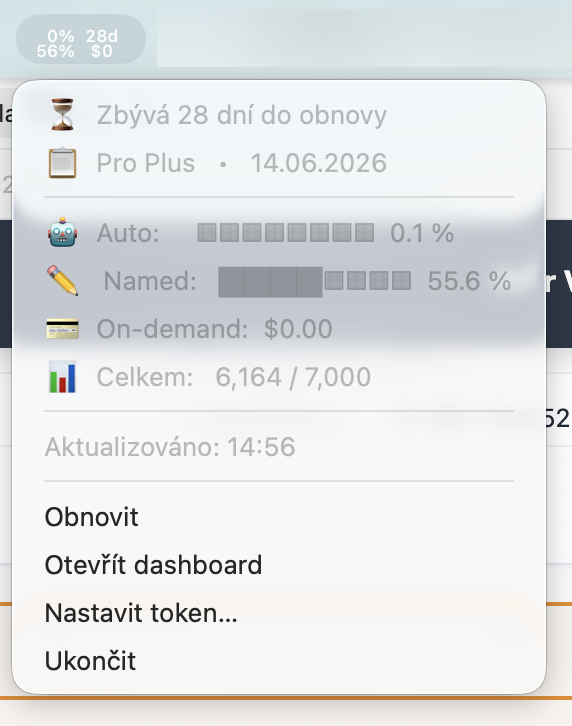

# Cursor Usage Menu Bar

A lightweight macOS menu bar app that shows your **Cursor plan & usage** at a glance — right in the menu bar, no browser needed.



---

## What it shows

**Icon** (always visible in menu bar):

```
 0%  28d
51%  $0
```

Two stacked percentages (Auto models / Named models) + days until renewal and on-demand spending — all in a tiny, perfectly centered icon.

**Menu** (click the icon):

```
⏳  28 days until renewal
📋  Pro Plus  •  14.06.2026

🤖  Auto:     ░░░░░░░░  0.1 %
✏️   Named:   ████░░░░  51.9 %
💳  On-demand:  $0.00
📊  Total:   5,735 / 7,000

Updated: 14:18

Refresh
Open dashboard
──────────────
Sign in via web…
Enter token manually…
Quit
```

---

## Requirements

- macOS 12 Monterey or later
- Python 3.9+ (included with macOS via Xcode Command Line Tools)

---

## Install

### 🤖 Install via Cursor AI (no Terminal needed)

Not a developer? No problem. Open **Cursor** and paste this prompt into the chat:

> Install the cursor-usage-menubar app from https://github.com/vokal-pe/cursor-usage-menubar — clone it, run install.sh, and walk me through signing in.

Cursor will clone the repo, run the installer, and guide you through signing in — no Terminal knowledge required.

---

### Manual install (Terminal)

```bash
git clone https://github.com/vokal-pe/cursor-usage-menubar.git
cd cursor-usage-menubar
bash install.sh
```

`install.sh` does three things:
1. Installs Python dependencies (`pip install -r requirements.txt`)
2. Optionally sets up auto-start on login (you will be asked)
3. Starts the app immediately

### Sign in

On first launch the icon shows `⌨ ?`. Click it and choose **Sign in via web…** — a native browser window opens `cursor.com/settings`. After you log in, the token is extracted automatically and the icon updates within seconds.

If you prefer, you can paste the token manually via **Enter token manually…**

---

## Uninstall

```bash
bash uninstall.sh
```

---

## 🔒 Security

> **tl;dr: The app is fully open source. Read every line. It only ever talks to `cursor.com`.**

### What network requests does this app make?

**Exactly one**: `GET https://cursor.com/api/usage-summary` — the same endpoint your browser hits when you open cursor.com/dashboard/usage.

You can verify this yourself:

```bash
# Watch all network connections made by the app in real time:
sudo lsof -i -n -P | grep Python
```

You will see **only** connections to `cursor.com` (IP addresses belonging to Vercel / Cloudflare).

### Where is my token stored?

In `~/Library/Application Support/cursor-usage/config.json` — on your Mac, in your user directory, accessible only to you. It is never transmitted anywhere except back to `cursor.com` as a cookie header.

### Does the app send any analytics or telemetry?

No. There is no analytics code, no crash reporting, no version-check pings, no third-party SDKs. The only imports are:

| Library | Purpose |
|---|---|
| `rumps` | macOS menu bar framework |
| `pyobjc` | Native macOS AppKit/WebKit bindings |
| `cryptography` | Decrypt Cursor app's local cookie store (AES-CBC, local key from macOS Keychain) |
| Python stdlib | `urllib`, `json`, `sqlite3`, `threading` — all standard |

### How can I verify no token leakage?

Search the entire codebase for all outbound URLs:

```bash
grep -r "https://" .
```

You will find exactly:
- `https://cursor.com` — the only server this app communicates with
- `https://cursor.com/settings` — the login page opened in the WebKit window
- `https://cursor.com/dashboard/usage` — the dashboard link in the menu

Nothing else.

### The login window — is it safe?

The **Sign in via web…** window is a standard macOS `WKWebView` — the same engine used by Safari. It loads `cursor.com` directly, just like a regular browser. Your password is entered on Cursor's own servers. This app only reads the resulting session cookie from the local cookie store after you are logged in — it never sees your password.

---

## How it works

```
Every 5 minutes:
  background thread → GET cursor.com/api/usage-summary
                     ↓
  parse JSON → build icon image (NSImage via AppKit)
                     ↓
  main thread timer → update NSStatusBarButton + menu items
```

CPU usage in steady state: **0.0%**. RAM: ~110 MB (one-time cost of loading AppKit/WebKit frameworks).

---

## Tracking installs / GitHub Stars

GitHub does not provide install counts for scripts. The best proxy is:
- ⭐ **Stars** on this repo
- 📦 **Release download counts** (visible on the [Releases](../../releases) page)

If you find this useful, a star is appreciated!

---

## Contributing

PRs welcome. The codebase is intentionally small:

| File | Purpose |
|---|---|
| `app.py` | Main app — menu bar icon, data fetching, menu |
| `login_window.py` | WKWebView login window for token acquisition |
| `install.sh` / `uninstall.sh` | Setup scripts |
| `requirements.txt` | Python dependencies |

---

## License

MIT — do whatever you want with it.
